# Strada

**A private record of the people you want to stay close to at Berkeley.**

Strada is a networking tracker built around one idea: a list of people should not be a
to-do list. Most contact trackers are guilt machines: *last contacted 94 days ago*,
three overdue, a streak you broke. That is why people open them twice and never again.
Strada is named for the café where you actually met these people, and it behaves like a
record rather than a queue: no time-decay, no overdue states, no streaks. You add
someone, write down where you met and what you want to talk about next, and the list is
still there being pleasant when you come back. Every contact is private to its owner, and
that privacy is enforced by Postgres row-level security rather than by application code.

**Live app: <https://strada-web-beta.vercel.app>**
API: <https://strada-api-dusky.vercel.app/health>

```
Frontend   React 19 + Vite + TypeScript + Tailwind v4      Vercel (project A)
Backend    Express 5 + TypeScript                          Vercel (project B)
Database   Neon Postgres, RLS on the contacts table
Auth       Neon Managed Better Auth (Ed25519 JWT)
Tests      143 automated (121 hermetic + 22 live)
```

---

## Contents

- [Product walkthrough](#product-walkthrough)
- [Features](#features)
- [Technology stack and why](#technology-stack-and-why)
- [Architecture](#architecture)
- [Database schema](#database-schema)
- [Authentication and RLS ownership](#authentication-and-rls-ownership)
- [Secrets: publishable versus server-only](#secrets-publishable-versus-server-only)
- [Local setup](#local-setup)
- [Environment variables](#environment-variables)
- [Tests](#tests)
- [Grading evidence](#grading-evidence)
- [Deployment](#deployment)
- [Optional: wiki sync](#optional-wiki-sync)
- [What went wrong, and what it changed](#what-went-wrong-and-what-it-changed)
- [Known limitations and what I would do next](#known-limitations-and-what-i-would-do-next)

---

## Product walkthrough

**Sign in.** One screen for both sign-in and sign-up, toggled; the fields are nearly
identical and guessing wrong should not cost you a navigation.

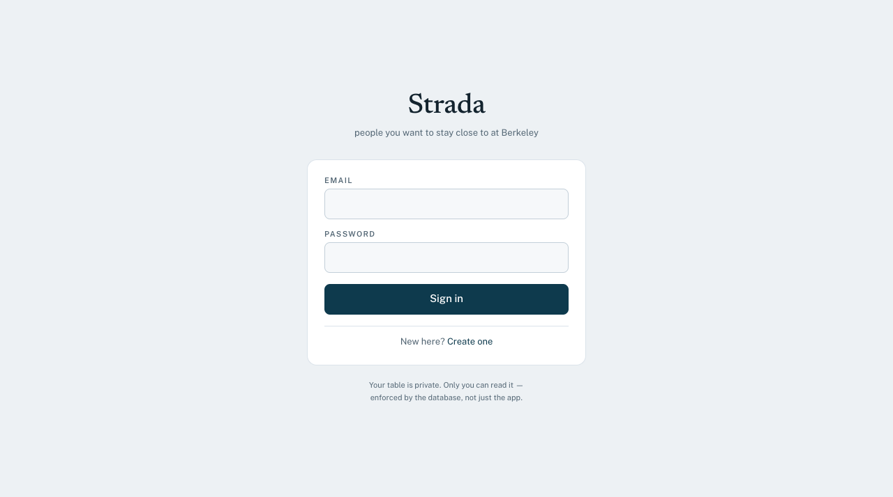

**The empty state.** Because the rubric requires a grader to create an account before
they can see anything, this is screen one of the product for every grader. Rather than
"no contacts yet", three phantom rows dissolve under the call to action, showing what a
populated table looks like, and teaching the priority encoding at all three lengths
before any data exists. The rows are `aria-hidden`, inert, and never touch the database.

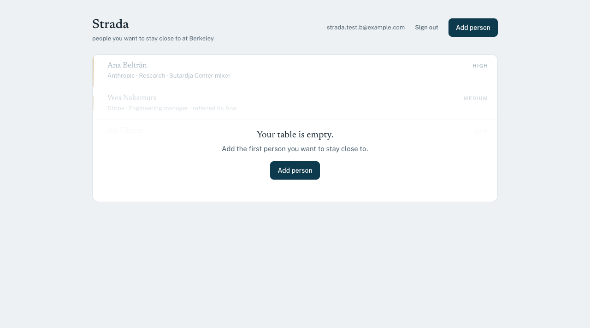

**The table.** One column, no navbar, rows separated by hairlines. Names are set in a
serif and are the loudest thing on screen; everything else is caption.

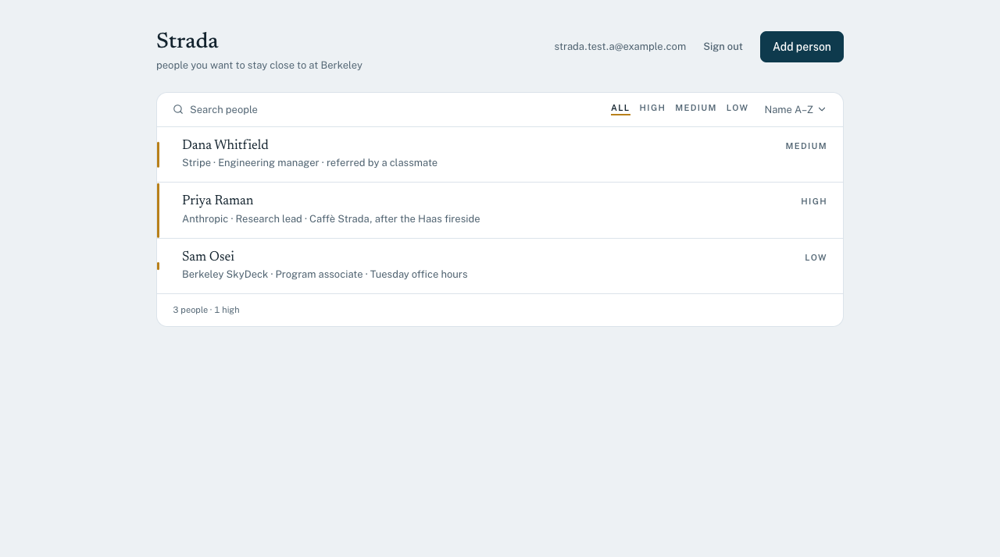

**Adding someone.** The priority control renders the real spine marks at their real
proportions, so the encoding is taught at the moment you choose, which is why no legend
appears anywhere else in the app.

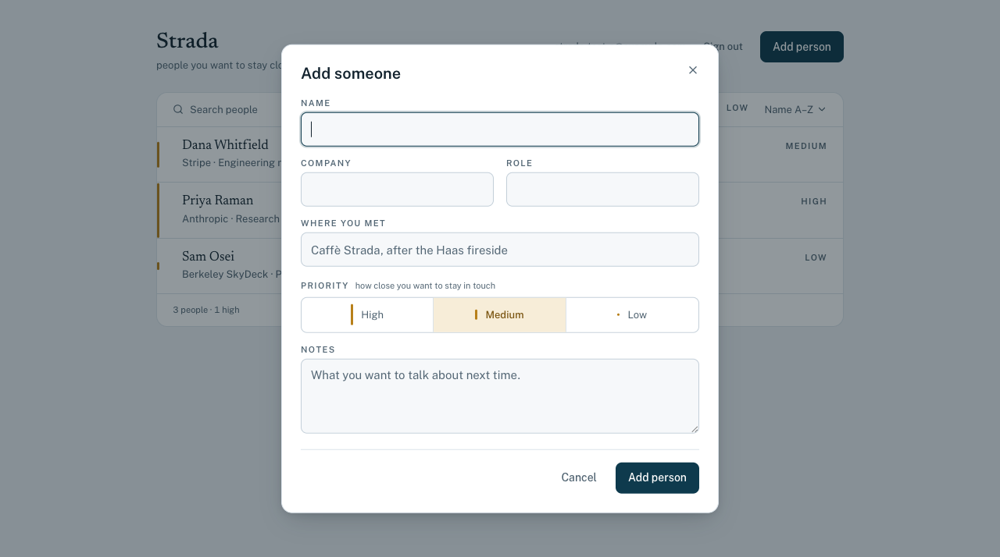

**Editing and removing.**

| Edit | Remove |
|---|---|
| 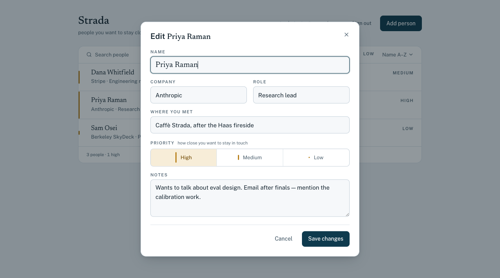 | 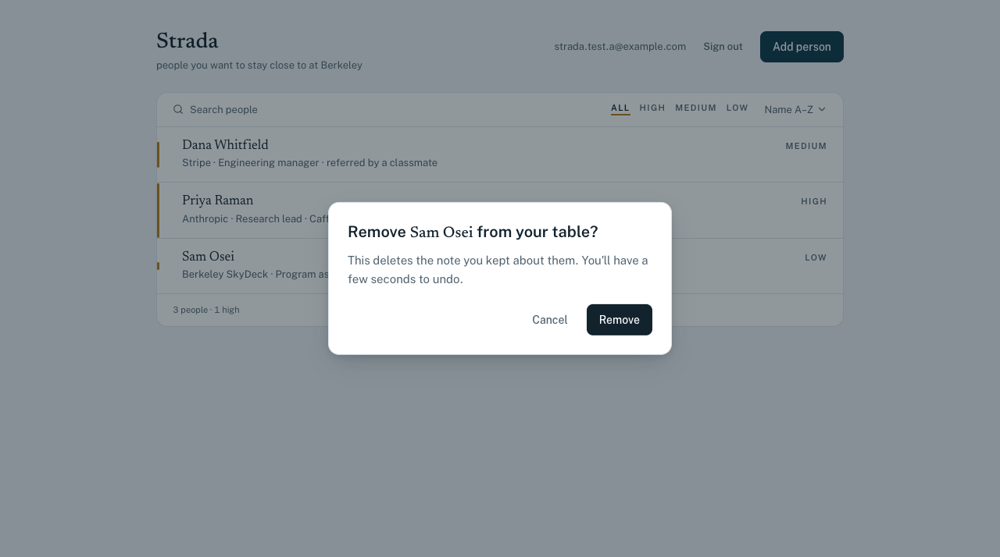 |

The Remove button is ink, not red. Deleting someone from your own private list is
tidying, not an error, and red is reserved for invalid input so the two are never
confusable on one screen. That is only defensible because undo exists:

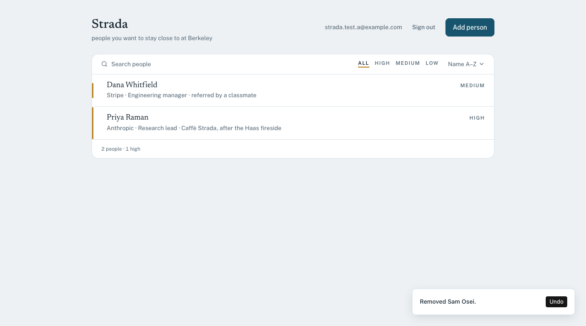

**Sort, filter, and search** live in one caption line, and the view lives in the URL, so
a filtered table survives a refresh and can be linked.

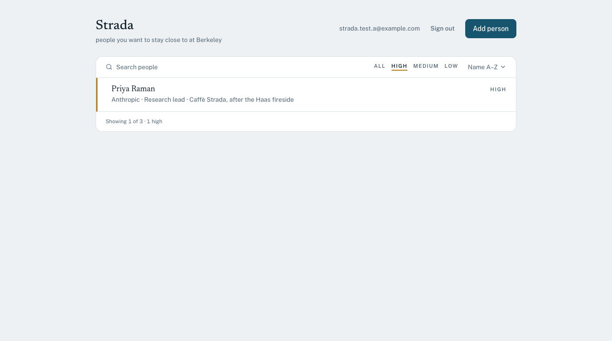

---

## Features

- Email sign-up, sign-in, and sign-out via Neon Managed Better Auth
- A private contact list per user: name, company, role, where you met, notes, priority
- Create, view, edit, delete, and undo a delete; everything persists in Neon Postgres
- Sort by name, company, priority, or recently added
- Filter by priority and search across every text field
- Sort, filter, and search are held in the URL, so a filtered view survives a refresh
- Priority accepts only `high`, `medium`, or `low`, enforced by a database constraint
- Distinct loading, empty, filtered-to-nothing, error, and success states
- Responsive from 375px up; light and dark themes

---

## Technology stack and why

| Layer | Choice | Why |
|---|---|---|
| Frontend | React 19 + Vite + TypeScript | Separate deployable from the backend, as required. Vite rather than Next.js because this is a private, client-rendered app with no SEO or SSR need; the Next.js runtime would be weight with no payoff. |
| Styling | Tailwind CSS v4 + Radix UI primitives | A token-driven design system rather than ad-hoc classes. Radix supplies accessible dialog, toggle, and menu behaviour, so keyboard and screen-reader support is not hand-rolled. |
| Backend | Express 5 + TypeScript (ESM) | A small, explicit HTTP layer, deployed as its own Vercel project so the frontend/backend separation is physical rather than a folder convention. |
| Validation | Zod, in a shared workspace package | One schema imported by both the API and the browser, so client and server cannot drift on what counts as valid. |
| Database | Neon Postgres | Real Postgres, so RLS policies, CHECK constraints, and triggers do the enforcement. |
| Auth | Neon Managed Better Auth | Issues the Ed25519 JWT whose `sub` claim RLS reads through `auth.user_id()`. |
| Data access | Neon Data API (PostgREST) | Reached with the end user's own token, which is what lets the API server hold no privileged database credential at all. |
| Hosting | Vercel, two projects from one repo | Separate builds and separate environment variables; one repository to submit. |
| Tests | Vitest + Supertest | A fast hermetic suite plus a live two-account RLS proof. |

---

## Architecture

```
┌─ apps/web ─ React + Vite ──────────────────┐   Vercel project A (static)
│  Neon Auth SDK: sign in / out, session     │   public env only
│  a fresh token per request                 │   never talks to the Data API directly
│  all CRUD → apps/api                       │
└────────────┬───────────────────────────────┘
             │  Authorization: Bearer <the user's own JWT>
             ▼
┌─ apps/api ─ Express 5 ─────────────────────┐   Vercel project B
│  CORS → verify JWT (JWKS) → validate (Zod) │   server-only env
│  builds every upstream request itself      │   no Postgres driver, no DATABASE_URL
└────────────┬───────────────────────────────┘
             │  the SAME user token, forwarded
             ▼
      Neon Data API (PostgREST)
             │  RLS: auth.user_id() = user_id     ← ownership is enforced HERE
             ▼
         Neon Postgres                            ← CHECK constraints
```

**Request flow for "add a contact".** The browser asks the auth adapter for a current
token and `POST /api/contacts` carries it. Express checks the signature against Neon's
JWKS, parses the body with the shared Zod schema (rejecting with a 400 and field-level
messages if it fails), strips any client-supplied `id`, `user_id`, or timestamp, sets
`user_id` from the verified `sub`, and calls the Data API **with the user's own token**.
RLS evaluates the INSERT policy's `WITH CHECK` and Postgres evaluates the CHECK
constraints. The written row comes back and is rendered.

### The design decision worth explaining

> **The database, not the API server, enforces ownership. No component in the request
> path holds a credential that bypasses RLS.**

The Express layer never connects to Postgres. It has no connection string and no Postgres
driver; `npm test` asserts both. It forwards the caller's own token, so every query it
makes is already scoped to that caller by RLS. A serious bug in the API (a missing
filter, a wrong id) still cannot return another user's row, because the credential
required to do that does not exist anywhere in the deployment.

Being precise about what that does **not** claim, since overclaiming here would be worse
than not claiming it at all:

- **The API is not the security boundary and is not meant to be.** The Data API is
  reachable by any signed-in user holding their own token. Every control in Express is
  fail-fast and UX; the enforceable guarantees are RLS and the CHECK constraints, which
  is why the input limits are stated in both the Zod schema and the database.
- **RLS bounds a request to the caller's own rows; it does not bound what they may do to
  those rows.** An unfiltered `DELETE` would wipe all of the caller's own contacts, so
  the API exposes no route that accepts a filter from a client: ids come from path
  parameters and every upstream URL is built server-side.
- **`id` is a `uuid`, not a sequential integer.** Constraint checks run outside RLS, so a
  duplicate-key error on a client-chosen integer id would reveal that a row exists
  regardless of who owns it, and probing a range would recover the global row census.

---

## Database schema

Defined in [`db/migrations/001_contacts.sql`](db/migrations/001_contacts.sql) and applied
with `npm run migrate`. Migrations own the schema **and** the policies; nothing is
created by clicking in a console, so every policy is reviewable in a diff.

### `contacts`

| Column | Type | Constraints | Notes |
|---|---|---|---|
| `id` | `uuid` | PK, `default gen_random_uuid()` | Not a sequential integer, on purpose; see above |
| `user_id` | `text` | `not null`, `default (auth.user_id())` | The owner. The only column RLS compares |
| `name` | `text` | `not null`, non-blank, ≤ 200 | `length(btrim(name)) > 0` |
| `company` | `text` | nullable, ≤ 200 | |
| `role` | `text` | nullable, ≤ 200 | |
| `met_where` | `text` | nullable, ≤ 200 | "where you met" |
| `notes` | `text` | nullable, ≤ 10000 | |
| `priority` | `text` | `not null`, `default 'medium'` | `check (priority in ('high','medium','low'))` |
| `created_at` | `timestamptz` | `not null`, `default now()` | |
| `updated_at` | `timestamptz` | `not null`, `default now()` | Maintained by a trigger, so a direct API caller cannot backdate it |

Also created: an index on `user_id`, and the `set_updated_at()` trigger.

Migrations 002 and 003 add the optional wiki-sync columns. They are additive and
nullable, so the ten columns above behave exactly as specified whether or not the sync is
ever run:

| Column | Type | Constraints | Notes |
|---|---|---|---|
| `wiki_slug` | `text` | nullable, ≤ 200, unique per user | Which wiki page this contact came from. Null for hand-made contacts |
| `bio` | `text` | nullable, ≤ 2000 | The wiki's summary of the person. Wiki-owned |
| `wiki_synced_at` | `timestamptz` | nullable | When sync last wrote. Also what the wiki-layer trigger keys on |

Migration 003 also drops `operator_set` (see [Two layers](#two-layers-so-there-is-nothing-to-arbitrate))
and adds the `reject_wiki_field_edit()` trigger.

The migration ledger deliberately lives in a separate `strada_meta` schema. Enabling the
Data API installs `ALTER DEFAULT PRIVILEGES ... GRANT ... TO authenticated`, so **every**
table created in `public` is fully writable by every signed-in user unless RLS says
otherwise. A bookkeeping table should not be defended with policies; it should be
unreachable, and only `public` is exposed.

---

## Authentication and RLS ownership

Neon Managed Better Auth issues the access token; Postgres reads its `sub` claim through
`auth.user_id()` and compares it to `contacts.user_id`. **That comparison is the entire
ownership rule**, and it runs inside the database on every statement.

### The ownership rule

```sql
alter table contacts enable row level security;
alter table contacts force  row level security;   -- owners bypass RLS without this

create policy contacts_select_own on contacts for select to authenticated
  using (auth.user_id() = user_id);

create policy contacts_insert_own on contacts for insert to authenticated
  with check (auth.user_id() = user_id);

create policy contacts_update_own on contacts for update to authenticated
  using (auth.user_id() = user_id)          -- gates the row as it exists
  with check (auth.user_id() = user_id);    -- gates the row as it would become

create policy contacts_delete_own on contacts for delete to authenticated
  using (auth.user_id() = user_id);
```

Four separate per-verb policies, not `FOR ALL`. `USING` and `WITH CHECK` are both present
on UPDATE and that pairing is load-bearing: `USING` alone would let a user rewrite their
own row's `user_id` and hand the row to someone else.

`FORCE ROW LEVEL SECURITY` matters more than it looks. Without it the table **owner**
bypasses every policy above, and the owner is the role a migration script or a
`psql $DATABASE_URL` session connects as.

### Token facts, decoded from a live token rather than taken from documentation

The published docs are ambiguous on two of these, and guessing wrong fails in ways that
look like a broken app rather than a misconfiguration.

| Property | Value | Why it matters |
|---|---|---|
| `alg` | `EdDSA` (Ed25519) | Not the RS256 most examples assume. Verification pins `algorithms: ["EdDSA"]`. |
| `iss` / `aud` | both present, both the auth **origin** | Both are pinned. The origin has no path, unlike the auth base URL. |
| JWKS URL | `${NEON_AUTH_BASE_URL}/.well-known/jwks.json` | Keeps the `/<db>/auth` path segment. Resolving a root-relative path against the base URL silently drops it and 404s. |
| `role` | `authenticated`, fixed by Neon | The Data API derives the Postgres role from this claim, so a user-settable value would be an escalation path. |
| Lifetime | **900 seconds** | See below. |

**Tokens expire after 15 minutes, so the browser never caches one.** The app asks the
adapter for a current token on every request; the adapter refreshes using an HttpOnly
cookie on the Neon Auth origin. A component reading a token off a session object captured
in a render would hold a stale one and start failing every write about fifteen minutes
in. The API client also retries once on a 401 to cover a token expiring in flight.

Issuer pinning is verified rather than assumed: replaying one valid token against a second
API instance configured with a wrong issuer returns 401, while the correctly configured
instance returns 200 for that same token.

---

## Secrets: publishable versus server-only

**Publishable** values are inlined into the browser bundle and are safe there because they
are endpoints, not credentials. Holding `NEXT_PUBLIC_NEON_AUTH_URL` grants nothing without
a valid signed session, and the RLS policies above protect every row the Data API exposes.

**Server-only** values are set in the API's Vercel project and never in the web project.

**`DATABASE_URL` is neither.** It is a local tool credential used only by `npm run
migrate` from a developer machine. It is not set in either Vercel project; the deployed
API has no Postgres driver and no connection string, and reaches the database only through
the Data API carrying the end user's own JWT.

Three mechanisms keep that true rather than merely stated:

1. **Structural.** Vite inlines only variables matching `envPrefix`
   (`["VITE_", "NEXT_PUBLIC_"]`). `DATABASE_URL` matches neither, so `import.meta.env`
   cannot expose it even if someone writes the reference.
2. **Asserted in tests.** `npm test` fails if any file under `apps/api/src` references
   `DATABASE_URL`, `postgresql://`, or a Postgres driver, and if any file under
   `apps/web/src` references a server-only variable name.
3. **Scanned.** `npm run check:secrets` greps the built bundle for connection-string
   literals and for the actual *values* of the secret variables, fails if any `.env` file
   other than `.env.example` is tracked in git, and fails if a secret's value has been
   copied into a `NEXT_PUBLIC_`/`VITE_` name, the mistake that would defeat
   mechanism 1 by making the value legitimately inlinable.

That third check has been corrected twice, in opposite directions. Its first version
grepped the bundle for server-only *variable names*, which could never fail, because Vite
inlines values, not identifiers; it passed unconditionally and proved nothing. The
value-based replacement then over-corrected: it treated `NEON_AUTH_BASE_URL` as a secret
and demanded its absence from the bundle. That URL is the sign-in endpoint the browser has
to call, shipped on purpose as `NEXT_PUBLIC_NEON_AUTH_URL` with the same value, so the
check failed on a correct build. A check that cannot fail proves nothing; a check that
fails when nothing is wrong gets skipped past, which comes to the same thing. The
client-exposure check is what that list was reaching for, and it is verified in both
directions: it passes on the real configuration and fails when a secret is deliberately
pasted into a `NEXT_PUBLIC_` variable.

---

## Local setup

```bash
git clone https://github.com/travisstephenfraser/strada.git
cd strada
npm install

cp .env.example .env.local     # then fill in real values

npm run migrate                # applies db/migrations/*.sql
npm test                       # 121 tests, no credentials needed

npm run dev:api                # http://localhost:3001
npm run dev:web                # http://localhost:5177
```

Requires Node 24 or newer. There is no `psql` dependency; migrations run through the
`pg` driver via `node db/migrate.mjs`.

After any migration, refresh the Data API schema cache:

```bash
neon data-api refresh-schema --project-id <id> --branch <branch> --database <db>
```

For a migration that only ADDS things, skipping this means PostgREST answers
`PGRST205 table not found` for anything new. For one that **drops or renames a column it
is a live outage**, and migration 003 caused one: PostgREST had `operator_set` in its
cached column list, kept naming it in the `SELECT` it generates, and Postgres answered
`42703 undefined column`, so every read through the API failed while the database itself
was perfectly healthy. `notify pgrst, 'reload schema'` is not a reliable substitute; it
reached only some instances, and reads flapped between 200 and 502 for several minutes
before the CLI refresh fixed it in one shot.

The ordering rule that follows: **deploy the code first, then migrate, then refresh the
cache immediately.** Deploying first costs nothing here, since the new code tolerates the
old schema and only the local sync CLI is affected, whereas migrating first breaks every
edit in the live app for the length of a deploy.

---

## Environment variables

Names and placeholders are in [`.env.example`](.env.example). No real values are
committed.

| Variable | Where | Purpose |
|---|---|---|
| `NEXT_PUBLIC_NEON_AUTH_URL` | web (public) | Neon Auth endpoint |
| `NEXT_PUBLIC_API_BASE_URL` | web (public) | The Express deployment |
| `NEON_AUTH_BASE_URL` | api | JWKS discovery. Not a secret: same value as `NEXT_PUBLIC_NEON_AUTH_URL`, which the browser needs |
| `NEON_DATA_API_URL` | api (server-only) | Upstream PostgREST |
| `NEON_AUTH_ISSUER` / `NEON_AUTH_AUDIENCE` | api (server-only) | Pinned JWT claims |
| `WEB_ORIGIN` | api (server-only) | CORS allowlist |
| `PORT` | api (server-only) | Local port |
| `DATABASE_URL` | **local only** | Migrations. Never added to Vercel |

`NEXT_PUBLIC_NEON_DATA_API_URL` is deliberately **not** set: the browser never calls the
Data API directly, so shipping the endpoint to the client would widen the surface for no
benefit. `NEON_AUTH_COOKIE_SECRET` is unused; the SPA holds a bearer token and there is
no server-side cookie session to sign.

---

## Tests

```bash
npm test           # 121 hermetic tests: no credentials, no network, no database
npm run test:rls   # 22 live tests: the privacy proof and the wiki-layer lock
```

**`npm test` needs no configuration**, so it runs immediately after a clone. It covers:

- **The validation contract.** Empty, whitespace-only, missing, and over-length names;
  every invalid priority (`"urgent"`, `"HIGH"`, `null`, `1`); trimming; empty optional
  fields dropped rather than stored; unknown keys discarded.
- **Route behaviour** with the upstream mocked. An invalid priority returns 400 **and
  never calls the database**; a missing or malformed bearer returns 401; a
  client-supplied `user_id` is replaced by the verified subject; a client-supplied `id`
  is stripped; a client query string cannot shape the upstream URL; client `Prefer` and
  `Accept-Profile` headers are not forwarded; there is no route for an unfiltered PATCH
  or DELETE; a `WITH CHECK` rejection maps to 403; an RLS-filtered row returns 404
  without revealing whether it exists.
- **Architectural invariants.** No API source file references `DATABASE_URL` or a
  Postgres driver, no web source file references a server-only variable, `envPrefix` is
  exactly the two public prefixes, and `.gitignore` excludes every `.env` but the example.

**`npm run test:rls` is a separate command on purpose.** It needs two real accounts, and
a security test that silently skips is worse than no test at all, because its skip prints
as a pass. Run without credentials it **exits 1** with a message naming what is missing.

---

## Grading evidence

### The app is live at a public URL

<https://strada-web-beta.vercel.app>

### A user can sign in and sign out

[Sign-in screen](docs/screenshots/01-sign-in.png) · signing out destroys the session
server-side, not just in the client; the token endpoint answers 401 afterwards.

### Add, view, edit, delete, and it survives refresh

[List](docs/screenshots/03-contact-list.png) ·
[add](docs/screenshots/04-add-form.png) ·
[edit](docs/screenshots/06-edit-contact.png) ·
[delete](docs/screenshots/07-delete-confirm.png) ·
[undo](docs/screenshots/08-deleted-with-undo.png)

Every operation was driven in a real browser against the deployed app and verified to
persist through a hard refresh. The [filtered view](docs/screenshots/09-filtered-url-state.png)
survives a refresh too, because sort, filter, and search live in the URL.

### One invalid input fails safely

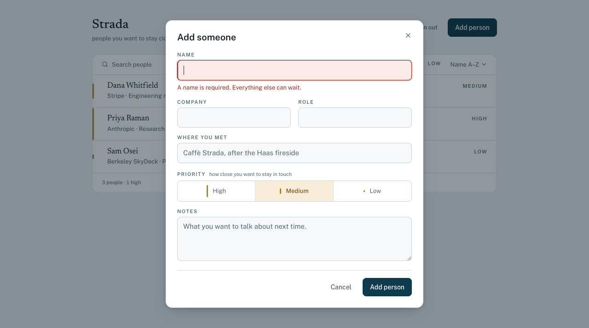

The message comes from the shared Zod schema, so the client and the server say the same
thing. **Stronger evidence than the screenshot:** posting an invalid priority straight to
the deployed API, bypassing the UI entirely, is rejected the same way.

```console
$ curl -sS -X POST https://strada-api-dusky.vercel.app/api/contacts \
    -H "Authorization: Bearer <valid token>" -H "Content-Type: application/json" \
    -d '{"name":"Should Not Exist","priority":"urgent"}'

{"error":"That contact could not be saved.",
 "fields":{"priority":"Priority must be high, medium, or low."}}   # HTTP 400
```

And a `priority` that somehow reached the database would still be refused by the
`contacts_priority_valid` constraint.

### User A cannot see or change User B's contacts

Two live suites run here. `two-account.test.ts` is the privacy proof below;
`wiki-layer.test.ts` proves the wiki layer is locked in the database rather than only in
`apps/api`, and ends by demonstrating the limit of that lock rather than implying it has
none.

```console
$ npm run test:rls

 ✓ the wiki layer is read-only to an ordinary write > refuses a change to name on a wiki-linked row 29ms
 ✓ the wiki layer is read-only to an ordinary write > refuses a change to company on a wiki-linked row 29ms
 ✓ the wiki layer is read-only to an ordinary write > refuses a change to role on a wiki-linked row 31ms
 ✓ the wiki layer is read-only to an ordinary write > refuses a change to met_where on a wiki-linked row 30ms
 ✓ the wiki layer is read-only to an ordinary write > refuses a change to bio on a wiki-linked row 98ms
 ✓ the wiki layer is read-only to an ordinary write > leaves the value in place after a refusal 59ms
 ✓ everything else still works > allows an edit that restates wiki fields without changing them 30ms
 ✓ everything else still works > allows the operator's own layer to change freely 30ms
 ✓ everything else still works > leaves a hand-made contact fully editable 29ms
 ✓ the limit of this guarantee, stated rather than hidden > lets a caller who sets wiki_synced_at through: this is not a security boundary 61ms
 ✓ User A's row, as seen by User A (positive control) > A can read the row A created 32ms
 ✓ User B cannot SEE User A's contacts > B's unfiltered read of the whole table does not contain A's row 32ms
 ✓ User B cannot SEE User A's contacts > B cannot read A's row even when asking for it by id 30ms
 ✓ User B cannot CHANGE User A's contacts > B's update of A's row affects nothing 61ms
 ✓ User B cannot CHANGE User A's contacts > B's delete of A's row removes nothing 126ms
 ✓ User B cannot CHANGE User A's contacts > B's unfiltered delete cannot reach A's rows 87ms
 ✓ Ownership cannot be handed to another user (WITH CHECK) > A cannot create a row owned by B 32ms
 ✓ Ownership cannot be handed to another user (WITH CHECK) > A cannot move their own row to B 76ms
 ✓ The wiki-sync columns do not weaken ownership > B cannot read A's wiki linkage 60ms
 ✓ The wiki-sync columns do not weaken ownership > B cannot write A's wiki layer, sync stamp or not 62ms
 ✓ An unauthenticated caller reaches nothing > the Data API refuses a request with no token 26ms
 ✓ An unauthenticated caller reaches nothing > the Data API refuses a forged token 28ms

 Test Files  2 passed (2)
      Tests  22 passed (22)
```

Two accounts sign in for real and the assertions run over HTTP against the **deployed**
Data API. Three design choices make this proof mean something:

1. **Not a direct Postgres connection.** `DATABASE_URL` connects as the table owner, and
   an owner bypasses RLS unless `FORCE ROW LEVEL SECURITY` is set; that version of the
   test would pass with the policies deleted. Going over HTTP also exercises JWKS
   verification, the exposed schema, and the grants, none of which a direct connection
   can see.
2. **B's reads carry no `WHERE` clause.** A filter would quietly do RLS's job and the
   suite would pass with RLS switched off.
3. **It was proven able to fail.** RLS was deliberately disabled on a throwaway branch
   and the suite re-run: **8 of the 12 assertions failed.** RLS was restored and it went
   green again. The same treatment was given to the wiki-layer trigger: dropped, suite
   re-run, **6 of its 10 assertions failed**. A guard that works produces no event, so a
   passing suite is not by itself evidence that the test is attached to anything.

That third check corrected an assumption in the design. The positive control ("A can read
A's row") was supposed to be what prevents a flattering pass, but with RLS off it stayed
**green**, as did both unauthenticated checks. The assertions that actually caught the
breakage were the unfiltered read, the two `WITH CHECK` cases, and the wiki-column write.

A fourth stayed green for a subtler reason worth recording: "B cannot read A's wiki
linkage" passed with RLS off, because an earlier assertion in the same file issues an
unfiltered `DELETE` that, with RLS off, had already removed the row it looks for. A
test can be made vacuous by a test that runs before it, which is its own argument for
checking that a suite fails rather than trusting that it passes.

### At least one automated test passes

```console
$ npm test

 Test Files  6 passed (6)
      Tests  121 passed (121)
```

Full output: [`docs/test-output-unit.txt`](docs/test-output-unit.txt) ·
[`docs/test-output-rls.txt`](docs/test-output-rls.txt). CI runs `npm test`, `npm run
build`, and `npm run check:secrets` on every push.

### No secret values committed

`.gitignore` excludes every `.env` but `.env.example`; a test asserts that, and
`npm run check:secrets` fails if a real `.env` is ever tracked, if a connection-string
literal reaches the built bundle, or if a secret's value has been copied into a
client-exposed variable name. Neither Vercel project holds `DATABASE_URL`.

Git history was scanned before this repository was made public: every blob in every commit
on every ref, checked both for credential patterns (`npg_`, `postgres://`, `sk-`, `ghp_`)
and for the literal current values of `DATABASE_URL` and the two RLS test passwords. The
only matches are the placeholder connection string in `.env.example`.

---

## Deployment

Both apps deploy from this one repository to two Vercel projects, each with its own Root
Directory (`apps/web`, `apps/api`) and its own environment variables. Pushing to `main`
deploys both.

**The step that is easy to miss:** the deployed origin must be added to Neon Auth's
trusted domains, or sign-in fails on the live site while working perfectly on localhost.

```bash
neon neon-auth domain list
neon neon-auth domain add https://<your-app>.vercel.app
```

Without it the auth endpoint answers `403 {"code":"INVALID_ORIGIN"}`. Nothing in the build
or the test suite can catch this; the code is byte-identical in both environments and
only the origin differs, so it is a checklist item rather than a guard.

Set environment variables for **all three** Vercel environments (Production, Preview,
Development). A variable set only for Production leaves every preview deploy blank.

---

## Optional: wiki sync

**Not part of the assignment.** An optional local tool that populates Strada from an
Obsidian vault, so the same people do not have to be typed twice. The app is complete
without it and nothing here runs on Vercel.

```bash
npm run sync -- --dry-run   # report only, writes nothing
npm run sync                # apply
```

### Why it cannot be a button

The vault is a directory on a laptop. Strada runs on Vercel. A hosted server cannot read
that directory, and giving it a way to would invert the architecture the rest of this
README defends. So the sync runs locally and reaches Strada through the same public API
as the browser, signing in as the same user; it holds no privilege the app does not
already have, and RLS applies to its writes identically.

The web UI shows sync **state** (a mark on wiki-sourced rows, and a footer counting
them) and cannot trigger a sync.

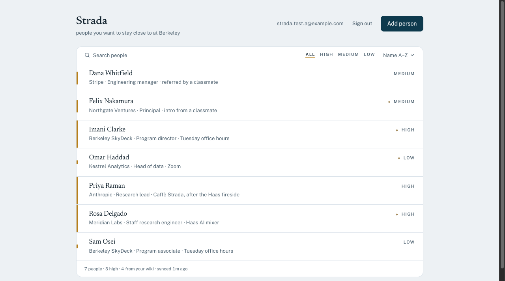

Four of these seven came from wiki pages and carry the mark; the other three were typed
into the app. Sorting, filtering and editing do not care which is which.

### What crosses the boundary, and what does not

```
vault (local) ─▶ local model ─▶ derived fields ─▶ Strada API ─▶ RLS ─▶ Postgres
                     ▲
        page text stops here
```

Extraction runs against a model on the same machine. What leaves is a name, company,
role, where you met, a priority, and one generated sentence describing who they are,
never verbatim page text. The vault contains other people's names, contact details and
candid assessments; they did not consent to that reaching a hosted service, which is why
a hosted model is not an option here even though it would extract better.

**The vault is read-only.** The sync opens files and does nothing else: no writes, no
moves, no git operations, not even a status check. Verified by checksumming every entity
page before and after three full runs. A write-back path is deliberately absent rather
than merely unused.

### Who the vault says is a person

Most of the network has no entity page and correctly never will. The vault folds people
into the work they belong to; its own log records **186 fold decisions against 100
splits**, and the two-person venture page carries an explicit one: *"Single page for the
pair rather than two thin person-pages, per fold discipline."* Reading only
`entities/*.md` therefore found 11 people out of a much larger real network.

Two frontmatter keys close that gap without unfolding anything:

| Key | Where | Meaning |
|---|---|---|
| `type: person` | an entity page | This entity is a person, not a laptop or a venture |
| `type: self` | one entity page | The vault owner. Read, never synced; you are not your own contact |
| `people: [A, B]` | any page | This page is the primary source for these people |

`people:` names the people a page is the *primary* source for, not everyone it mentions;
one name appears on six pages and belongs to one of them. Each person is slugged exactly
as an entity page for them would be (`Rosa Delgado` → `rosa-delgado`), so if someone is
later promoted to their own page the identity does not move and the contact updates
instead of duplicating. An entity page wins a slug collision, being the richer source.

For a page carrying several people the extraction prompt is scoped to one name at a time;
without that the model returns whichever person it noticed first and a two-person page
silently yields one contact twice.

### Both visibility tags are included, and one field is not

Neither tag means "keep this person out of my own private, row-level-secured list".
`visibility/internal` means do not publish. `visibility/pii` marks a page whose **body**
is sensitive: compensation, routing, things said in confidence.

Sync never transmits page text, so what a `pii` page contributes is a business card:
name, company, role, where you met. The one field that could carry the page's substance
is `bio`, because it is the model's summary *of* that prose, so **`bio` is dropped for a
`pii` source**. The person becomes reachable; the sensitive material stays on the machine.

Excluding those people outright was the earlier default and it made the tracker
arbitrarily incomplete: eleven real people were already synced to the same hosted
database while one relationship was held out on a tag describing prose that never leaves
the vault. `--exclude-pii` restores the stricter behaviour.

This was verified before it ran for real, by printing what *would* be sent: the model
produced 150 and 138 characters of bio for the two `pii`-sourced people and neither left
the machine. That check matters because the failure is flattering; a broken drop would
still report a successful sync.

**Every exclusion is named in the report**, because a silent exclusion is
indistinguishable from a page that was never found.

### Two layers, so there is nothing to arbitrate

A contact that came from the wiki has two halves, and each has exactly one writer:

| Layer | Fields | Written by | Read-only to |
|---|---|---|---|
| Wiki | `name`, `company`, `role`, `met_where`, `bio` | sync, every run | the app |
| Yours | `notes`, `priority` | the app | sync, always |

`priority` is seeded once when sync first creates the contact and never asserted again.
It is a judgement about a relationship, not a fact about a person, and the extraction is
measurably weak at it (see the finding below), so the wiki gets a first guess and you
keep the decision.

A hand-made contact has no wiki layer at all: every field is yours, and the CRUD
behaviour is exactly what it was before any of this existed.

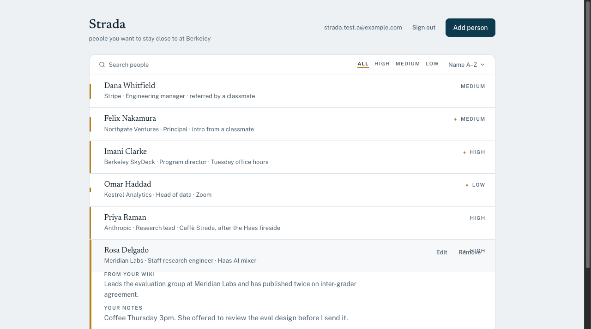

Expanding a wiki-linked contact shows both: the wiki's account of the person in the
faint ink it uses for reference material, and your own notes below it in the ink used
for things you wrote. The three rows without the ◆ mark are hand-made and have no upper
half at all.

**This replaced a per-field claim system, and the replacement is smaller.** The previous
design let sync and the app both write `notes`, then arbitrated: an `operator_set` column
recording which fields a human had claimed, a `POST /:id/reclaim` endpoint to release a
claim, and a `protected` section in the run report to announce refusals. All of it
existed to manage a collision. Splitting the columns by owner removes the collision, and
about eighty lines of arbitration went with it. The lesson that motivated `operator_set`
is kept: automation must never clobber what a human wrote. It is now a property of which
columns each party can write rather than a rule sync has to remember to consult.

Sync never deletes. A contact whose page disappears is reported as `orphaned` and left.

### Where the lock actually lives, and what it is worth

The app cannot change a wiki-owned field. That is enforced twice, and the two are worth
telling apart:

1. **`apps/api`** compares the patch against the stored row and answers `403` naming the
   field. This is the half that produces a good error message.
2. **A `BEFORE UPDATE` trigger** (migration 003) refuses the write at the database. This
   is the half that still holds when the API is wrong.

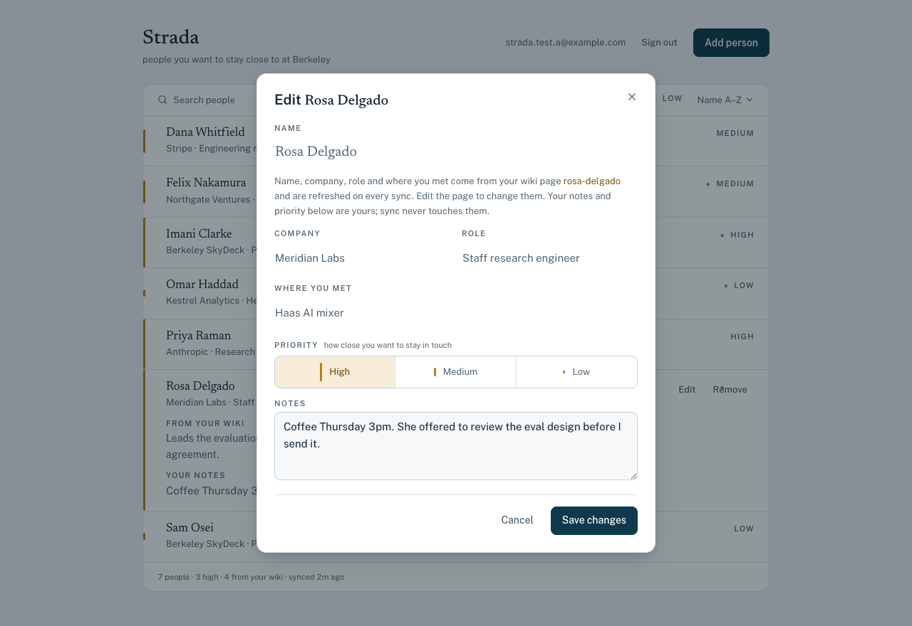

In the form the wiki fields keep their values but lose their input chrome, and a line
names the page they come from. Disabling them is a courtesy that explains the model;
the guarantee is the two checks below, not the `disabled` attribute.

The comparison is by **value, not by presence**. The edit form submits every field, so an
ordinary edit of a wiki-linked contact necessarily restates `name`, `company`, `role` and
`met_where`. Rejecting a body that merely *mentions* a wiki field would reject every edit,
including one that only touched notes, so both layers use `IS DISTINCT FROM` and object
only to a real change.

**This is a correctness guarantee, not a security boundary, and the difference is not
cosmetic.** Sync and the browser reach Postgres through the same Data API carrying the
same end-user JWT, so the database cannot tell them apart by role. The only thing marking
a write as sync's is that it advances `wiki_synced_at`, and a client holding its own
token can set that column too. The trigger stops the application from corrupting its own
data model; it does not stop the row's owner, and it is not trying to. RLS is the real
boundary and it defends against a genuinely different thing: *other users*. That claim is
proved separately in `tests/rls/two-account.test.ts`.

The bypass is not left as an inference. `tests/rls/wiki-layer.test.ts` ends with a test
that performs it and asserts it succeeds, so if this guarantee ever strengthens, that
test fails and this section has to be rewritten.

### The report names outcomes, never a total

`created`, `updated` (with the field names), `unchanged`, `excluded`,
`skipped`, `orphaned`, `failed`, each printed even when empty. "14 synced" would read
as success whether the run did the right thing, rewrote identical values, or quietly
refused half its input. A test asserts that running twice produces an all-`unchanged`
second run.

### A finding worth recording

The first live run marked **every** one of the eleven people `high`. A field with no
variance carries no information, and priority drives sorting and filtering, so the
feature was silently useless. The prompt had asked only "how actively worth staying
close to this person appears to be", which is too vague to be a measurement.

Two things fixed and confirmed it. The prompt now gives criteria the model can apply
(high means a specific open loop exists; medium is the common case; seniority is
explicitly not an open loop), and the distribution became **9 high / 2 medium**.
Separately, four engineered pages checked that the model can discriminate at all: a
clear open loop scored high, while a warm relationship with nothing outstanding, a
brief encounter, and a very senior contact with no open loop all scored low.

The residual skew is real rather than degenerate, since someone only writes a wiki page
for a person they have live business with, but the lesson is that it took a deliberate
check to tell "the data is like that" apart from "the measurement is broken", and the
first answer looked exactly like the second.

### Setup

```bash
npm run sync:login    # once: verifies the password, then stores it in the keychain
npm run sync          # thereafter
```

Needs `STRADA_VAULT_PATH`, `STRADA_API_URL` and `STRADA_SYNC_EMAIL` in `.env.local`
(gitignored), and LM Studio running locally with a model loaded.

**The password is not one of them.** It is a real account credential that can read and
change every contact the account owns, so it is resolved from the macOS keychain first,
then an interactive prompt, and only last from `STRADA_SYNC_PASSWORD`, which prints a
warning because it means a live password is sitting in plaintext on disk.
`sync:login` verifies the password against Neon Auth before storing it, so a typo fails
there rather than silently at the next sync.

If the model is unreachable the CLI **exits non-zero** rather than writing a degraded
sync that looks like a successful one.

No vault path or vault content is committed. Tests run against a synthetic fixture vault
of invented people, and a test fails if any source file contains a vault path.

---

## What went wrong, and what it changed

Nothing in the rubric asks for this section. It is here because the interesting part of
building this was not the parts that worked, and because a README that reports only
successes is evidence of editing rather than of engineering.

Five failures, in the order they would matter to someone maintaining this. Each is what
broke, why it was not caught, and what changed as a result.

### Real people's data reached a public repository

The screenshot demonstrating wiki sync was taken against the real vault. Eight rows were
visible; seven were real people, with names, employers, roles and where they were met.
It was committed, and the repository was then made public before anyone noticed. GitHub's
traffic API recorded zero views, zero clones and zero forks for that day, so there is no
evidence anyone fetched it, but that is luck, not a control, and the exposure window was
never measured precisely enough to be worth quoting.

Why it was not caught: the image was never referenced from the README. Every review pass
read the prose, and an unreferenced file is not in the prose. `npm run check:secrets`
passed the whole time and was right to; it hunts for credentials, and this was
disclosure of other people's information, which no grep for `npg_` will ever find.

What changed: the repository was made private, every commit was rewritten to purge the
image and the names from history, and the result was verified from a fresh clone. The
test account was rebuilt on a fictional cast, and every screenshot in this README is shot
against that account. The durable fix is upstream of any scanner: demo data is fictional,
so a screenshot cannot leak something real.

The residue is honest: rewriting history does not unpublish anything that was already
fetched, and unreachable objects stay addressable by SHA until the host garbage-collects
them.

### A secret check that could not fail, then one that always failed

`scripts/check-no-secrets.sh` has been wrong twice, in opposite directions. Version one
grepped the built bundle for server-only variable *names*. Vite inlines values, not
identifiers, so the string it searched for could never appear: the check passed
unconditionally and proved nothing.

Version two searched for the *values* instead, and included `NEON_AUTH_BASE_URL` in the
list. That URL is the sign-in endpoint the browser has to call and ships on purpose as
`NEXT_PUBLIC_NEON_AUTH_URL`, so the check failed on every correct build, and it went
unnoticed because it only fails when run with the API's environment loaded, which is not
how anyone runs it casually.

A check that cannot fail and a check that always fails are the same check. Both teach you
to stop reading the output.

What changed: the current version checks the thing the list was reaching for, a secret's
value copied into a `NEXT_PUBLIC_`/`VITE_` name that Vite would then inline by design,
and it is verified in both directions, passing on the real configuration and failing when
a secret is deliberately planted in a public variable. The three mechanisms it sits
alongside are in [Secrets](#secrets-publishable-versus-server-only).

### Dropping a column took the live API down

Migration 003 drops `operator_set`. PostgREST caches each table's column list, so it kept
generating `SELECT`s naming a column that no longer existed and Postgres answered `42703
undefined column`. Every read through the deployed API failed while the database itself
was entirely healthy.

Two things made it worse than it needed to be. `notify pgrst, 'reload schema'` looked like
it worked: reads recovered for a minute, then failed again, because only some instances
had reloaded, and an intermittent fault is much easier to misdiagnose than a constant one.
And the first sampling of the deployed API printed only status codes, so a `200` that was
in fact a stale-cache flap read as a recovery.

What changed: `neon data-api refresh-schema` fixed it in one call and is now the
documented step, printed by `db/migrate.mjs` after every migration with an explicit
warning for drops and renames. The deployment order is written down too (see
[Deployment](#deployment)): deploy the code, then migrate, then refresh, because the
reverse breaks every edit in the live app for the length of a deploy.

### A passing test hid a broken trigger

The first version of the wiki-layer trigger built its list of changed columns with
`changed := changed || 'name'`, which makes Postgres parse the right operand as an array
literal. The trigger raised `malformed array literal` instead of the intended rejection.

The test asserted that the write was refused. It *was* refused, by a syntax error. The
assertion passed on a completely broken trigger.

What changed: `array_append`, and more importantly the test now asserts on the sqlstate
and the message text, so a different error cannot pass as the right one. Both guards in
this project were then deliberately broken to confirm the tests notice: dropping the
trigger fails 6 of its 10 assertions, and disabling RLS fails 8 of 12.

That second experiment found something else worth keeping. One assertion stayed green
with RLS switched off, not because it was weak, but because an earlier assertion in the
same file issues an unfiltered `DELETE`, which with RLS off had already removed the row it
looks for. A test can be made vacuous by a test that runs before it.

### Every contact came back "high"

The first live extraction marked all eleven people `high`. Priority drives sorting and
filtering, so the feature was silently useless, and a field with no variance carries no
information at all. The full write-up is in
[A finding worth recording](#a-finding-worth-recording); the short version is that the
prompt asked something too vague to be a measurement, and the fix was in the prompt rather
than the data.

The design changed as well, not just the prompt. `priority` is now seeded once and then
owned by the operator, because it is a judgement about a relationship rather than a fact
about a person, and a signal known to be weak should not be re-asserted over a human's
correction on every run.

---

## Known limitations and what I would do next

- **Undo re-creates rather than restores.** The undone contact comes back with a new
  `id` and a new `created_at`. A soft-delete column would preserve identity, at the cost
  of every policy and query having to filter on it.
- **Sorting and filtering happen in the browser.** The API returns all of the caller's
  own rows. That is right for a personal list of tens of people and wrong at thousands;
  server-side paging would mean exposing an ordering and filter grammar to the client,
  which is exactly the surface the API currently refuses to accept.
- **The bundle is large** (~740 kB, 210 kB gzipped), dominated by the Better Auth client.
  Code-splitting the authenticated view away from the sign-in screen is the obvious win.
- **Every Neon package is a pinned beta** with exact-version peer dependencies. Versions
  are pinned without `^` and the lockfile is committed; `npm update` would break it.
- **The two-account proof needs credentials**, so CI runs only the hermetic suite. A
  seeded ephemeral Neon branch per CI run would let the RLS proof run on every push,
  which is where it belongs.
- **No email verification or password reset.** Neon Auth supports both; neither is
  required here and both add flows that would need their own tests.
- **Wiki sync is optional and local.** It cannot run on Vercel, so a fresh clone with no
  vault simply never uses it. Extraction quality is bounded by whichever local model is
  loaded, and a hosted model is deliberately not an option.
- **A wiki field can only be corrected in the wiki.** There is no "detach this contact
  from its page" action and no way to override one field locally. Editing the vault page
  and re-syncing is the only path, which is right for a fact that is wrong in the vault
  and awkward for one you simply want to say differently here.
- **`name` is wiki-owned, so renaming a page renames the contact.** Names are identity,
  and this is the field where that silent rewrite is most surprising.
- **The RLS suite is destructive by design.** One assertion issues an unfiltered
  `DELETE`, which is safe only while RLS works. Point it at a throwaway branch, never at
  data that matters; running it with RLS disabled empties the table, which is exactly
  what happened once while proving the suite could fail.
